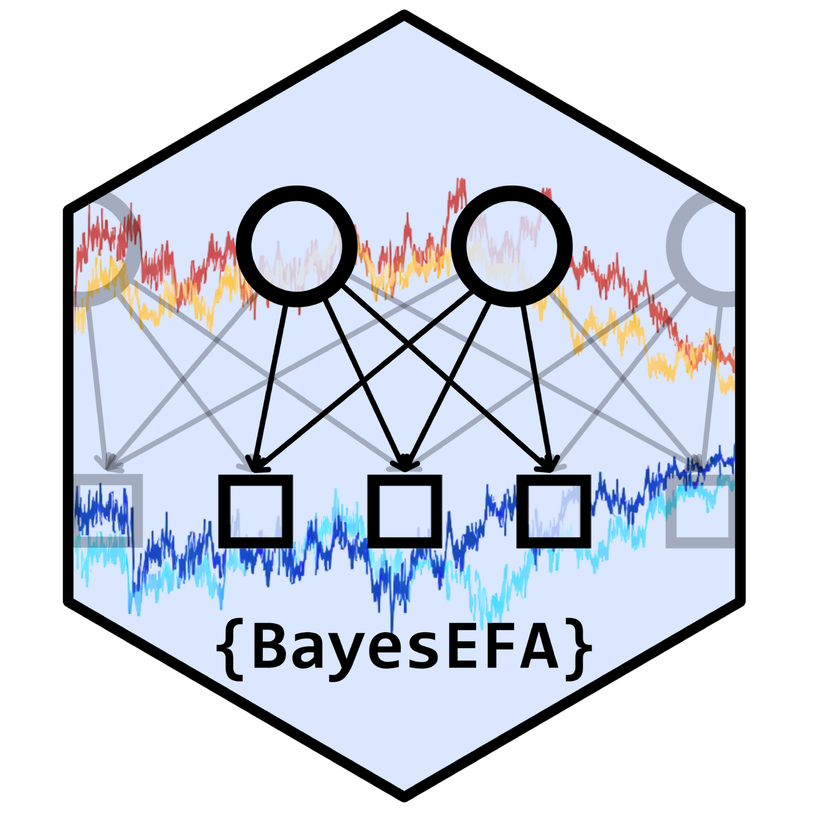

<!-- README.md is generated from README.Rmd. Please edit that file -->

```{r, include = FALSE}
knitr::opts_chunk$set(
  collapse = TRUE,
  comment = "#>",
  fig.path = "man/figures/README-",
  out.width = "80%"
)
```

# BayesEFA: Bayesian Exploratory Factor Analysis 

<!-- badges: start -->
[](https://github.com/RicardoReySaez/BayesEFA/actions/workflows/R-CMD-check.yaml)
[](https://CRAN.R-project.org/package=BayesEFA)
[](https://lifecycle.r-lib.org/articles/stages.html#experimental)
<!-- badges: end -->

The **BayesEFA** package provides a simple and intuitive framework for estimating Bayesian Exploratory Factor Analysis (EFA) models via `Stan`. 

## Key Features

*   **Zero Constraints:** Estimate unrestricted factor loading matrices without fixing parameters.
*   **Rotational Indeterminacy Resolved:** Recovers interpretable posterior distributions using an efficient Rotation-Sign-Permutation (RSP) alignment algorithm.
*   **Flexible Specifications:** Built-in support for correlation, covariance, and unstandardized models with flexible prior distributions.
*   **Missing Data:** Natively handles missing data via Full Information Maximum Likelihood (FIML).
*   **Full Posterior Inference:** Computes Bayesian SEM fit indices, Omega reliability estimates, and factor scores with full uncertainty quantification.
*   **Intuitive & Robust:** Solves non-positive definite matrices and Heywood cases by default, while remaining as easy to use as `psych`.

## Installation

### 1. Install `cmdstanr` (Highly Recommended)

While `BayesEFA` natively supports `rstan` out of the box, we strongly recommend using the `cmdstanr` backend for significantly faster estimation and a lower memory footprint. Please install `cmdstanr` by following the [official guide](https://mc-stan.org/cmdstanr/articles/cmdstanr.html).

### 2. Install BayesEFA

You can install the development version of BayesEFA from [GitHub](https://github.com/RicardoReySaez/BayesEFA) with:

```r
# install.packages("devtools")
devtools::install_github("RicardoReySaez/BayesEFA")
```

Once installed, **BayesEFA** will automatically detect and use `cmdstanr` if it is available on your system.

## Quick Start

Here is a basic example showing how to fit a Bayesian EFA model:

```r
library(BayesEFA)

# Fit a 3-factor Bayesian EFA model using the built-in Holzinger-Swineford dataset
fit <- befa(data = HS_data, n_factors = 3)

# Print a comprehensive summary of the model
summary(fit)
```

For a complete guide on how to perform a Bayesian EFA from scratch, please visit the [Getting Started](articles/getting_started.html) tutorial or explore the comprehensive package website!

